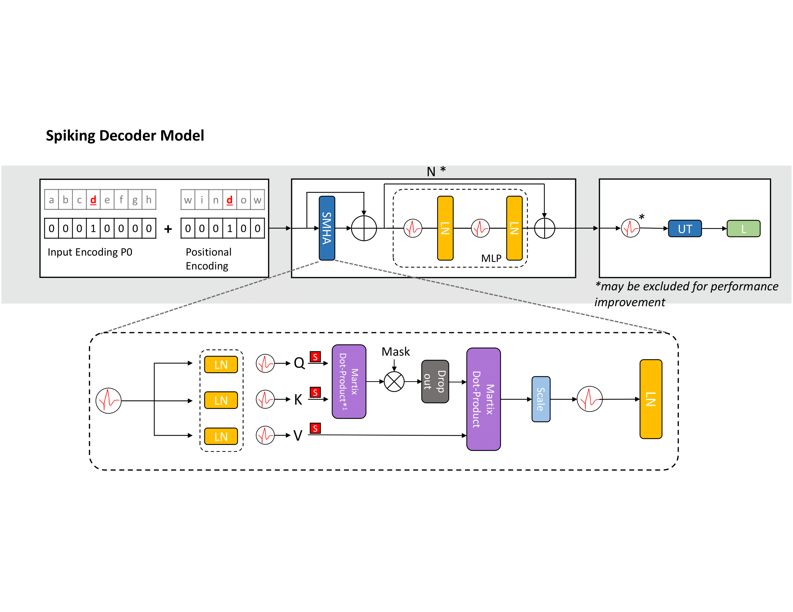
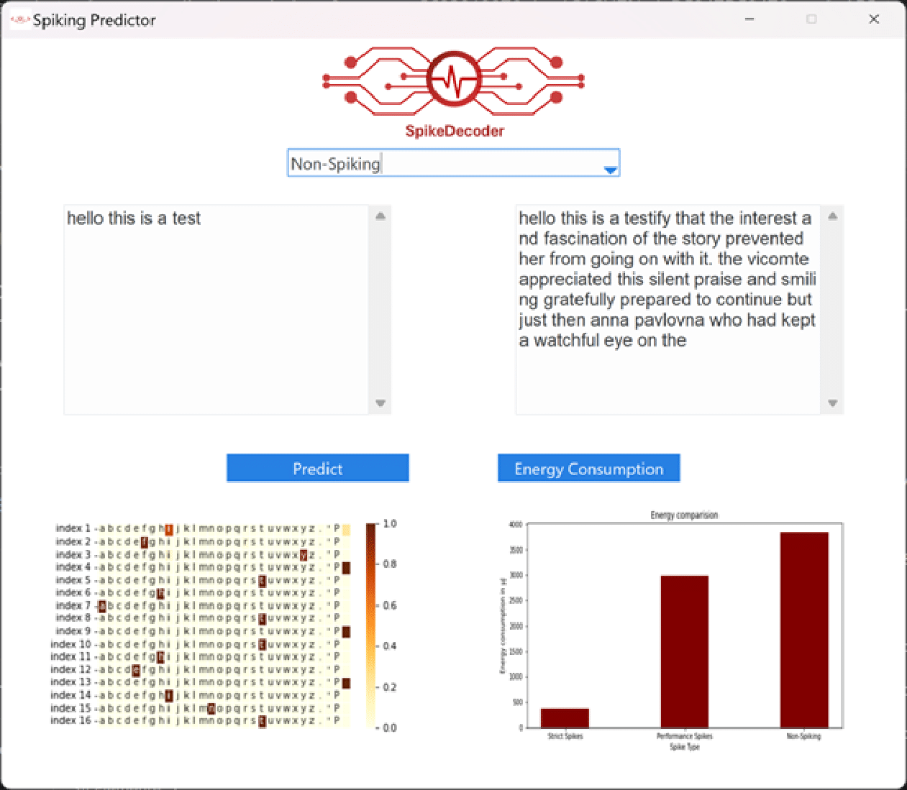

# SpikeDecoder: Realizing GPT-style Natural Language Processing with Spiking Neural Networks

Using the Spiking Self Attention mechanism first introduced in [Spikformer](https://github.com/ZK-Zhou/spikformer), we present a fully-spiking variant of the GPT decoder-only architecture. The model can be applied to language generation on character, as well as word embedding input.

## Visuals


## Training 
To enable a generalized training environment, the utils file provides a number of methods to prepare arbitrary datasets, but this has not been tested extensively. Generally, one should instantiate a Trainer (trainer.py) and supply it with the corresponding word/charDataset as supplied by utils. For word Embedding, the datasets make some assumptions to improve performance, such as stripping and replacing symbols.

## Training
In order to create a customized version of either the SpikeDecoder, partially spiking decoder, or non spiking decoder model, you can use the following code:

```
import model
from utils import wordDataset
from trainer import Trainer
device = torch.device("cuda" if torch.cuda.is_available() else "cpu")
config = model.SDconfig(30, 256, encodingType='learned', position_encoding_strategy='static', tok_embed_dim=50, heads=5, blocks=12, timesteps=4, device=device)
decoder = model.SpikingDecoderModel(config, dim_hid=16)
train_dataset = wordDataset('literature/leo tolstoy - war and peace.txt', 'train', inputLength=256, fullLength=100000, seed=7070)
test_dataset = wordDataset('literature/leo tolstoy - war and peace.txt', 'test', inputLength=256,  fullLength=100000, seed=7070)
trainer = Trainer(config, decoder, lr=0.001, train_dataset=train_dataset, test_dataset=test_dataset, batch_size=32, checkPointRate=3, epochs=10, save_model=True, num_workers=8)
trainer.train()
```
or alternatively, if you want to use a word embedding, you need to pass a dictionary parameter

```
import model
from utils import wordDataset, Reader
from trainer import Trainer
device = torch.device("cuda" if torch.cuda.is_available() else "cpu")
reader = Reader()
config = model.SDconfig(30, 128, encodingType='learned', position_encoding_strategy='static', tok_embed_dim=90, heads=5, blocks=20, timesteps=4, device=device, dictionary=reader.createDictionary("literature/leo tolstoy - war and peace.txt", prune_level=6))
decoder = model.SpikingDecoderModel(config, dim_hid=16)
train_dataset = wordDataset('literature/leo tolstoy - war and peace.txt', 'train', inputLength=128, fullLength=0, seed=7070, reader=reader)
test_dataset = wordDataset('literature/leo tolstoy - war and peace.txt', 'test', inputLength=256,  fullLength=0, seed=7070, reader=reader)
trainer = Trainer(config, decoder, lr=0.001, train_dataset=train_dataset, test_dataset=test_dataset, batch_size=32, checkPointRate=3, epochs=10, save_model=True, num_workers=8)
trainer.train()
```

This will launch a corresponding training process. Of course, there is a multitude of other flexible parameters, which you can further investigate in the model signature documentation. The training process may also take longer than what you are used to in ANN training so the hyperparameters might need some tailoring.
You can also pass custom dataset locations in the Dataset creation, which should be processed and cleaned automatically. If you wish to use the GridSearch implementation in this repository, some further adjustments in the skorch code maybe needed depending on your installed version.

## Usage
In addition to custom training, we provide a small graphical user interface for an intuitive comparison of the different model parameters and energy consumption.



To launch it, simply execute the model_GUI.py file. Please note that text generation can take quite a while, depending on the model type. After the generation is done, you can display the estimated energy consumption by clicking on the corresponding button, which uses the observed spiking frequency of your previous input prompt. Additionally, you may switch between char and word embedding via a switch on the top right. Please note that the word embedding models have only been trained on peace and war, so their dictionary is limited and may include some odd entries rather than common normal words. 

## Support
If you need assistance or have a question about the model, please feel free to make a discussion post.

## Authors and acknowledgment
This project was developed during my bachelor's thesis at the Technical University of Munich with the assistance of my Advisor Professor Florian Walter.

## Project status
The paper of this project is registered for open review at Frontiers in Neuroscience. 

## Citation
If this model or the corresponding paper is relevant to your work, please cite us at: 
