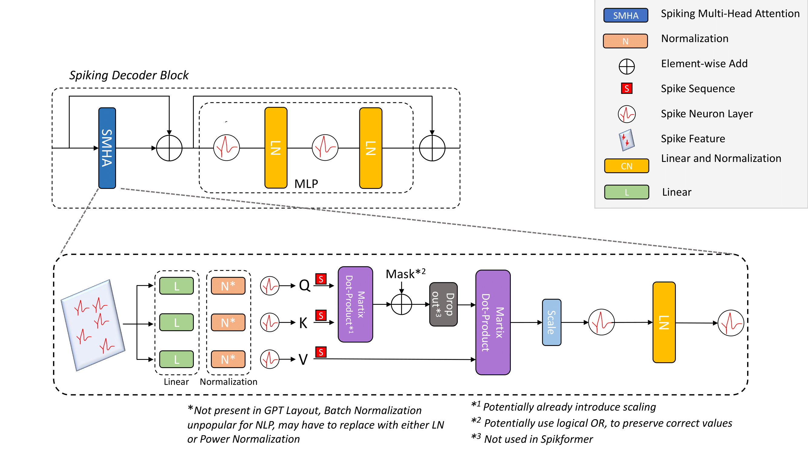
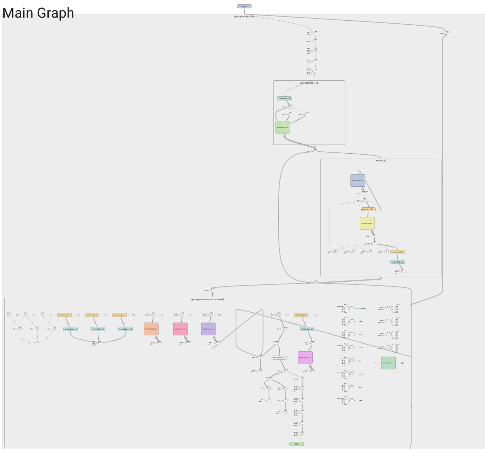

# SpikeDecoder: Realizing GPT-style Natural Language Processing with Spiking Neural Networks

Using the Spiking Self Attention mechanism first introduced in [Spikformer](https://github.com/ZK-Zhou/spikformer), we present a fully-spiking variant of the GPT decoder-only architecture. The model can be applied to language generation on character, as well as word embedding input.

## Description
The Spiking Decoder Block enables the model to compute self-attention values based on the computed output.

## Visuals

## Installation
Within a particular ecosystem, there may be a common way of installing things, such as using Yarn, NuGet, or Homebrew. However, consider the possibility that whoever is reading your README is a novice and would like more guidance. Listing specific steps helps remove ambiguity and gets people to using your project as quickly as possible. If it only runs in a specific context like a particular programming language version or operating system or has dependencies that have to be installed manually, also add a Requirements subsection.

In order to enable the GridSearch, subclass the NeuralNetClassifier get_loss method, with the following content:

if isinstance(self.criterion_, torch.nn.NLLLoss):  
&nbsp;&nbsp;eps = torch.finfo(y_pred[0].dtype).eps  
&nbsp;&nbsp;y_pred = torch.log(y_pred[0] + eps)  
        targets = y_true[...,-1,:,:]*  
        return super().get_loss(y_pred[0], targets, *args, **kwargs) 
*only if applied to the spiking variant

and 
   return self.infer(Xi)[0]
in net.evaluation_step

and y_proba = torch.from_numpy(y_proba) 
in NeuralNet.predict_proba()

and     
X = self.predict_proba(X).argmax(dim=-1)
X = torch.reshape(X, (X.shape[0], -1))
return X
in NeuralNetClassifier.predict

and 

comment out 
#x = to_tensor(x, device=self.device)
in NeuralNetClassifier.infer
for search on the NonSpiking Variant

## Usage
Use examples liberally, and show the expected output if you can. It's helpful to have inline the smallest example of usage that you can demonstrate, while providing links to more sophisticated examples if they are too long to reasonably include in the README.

## Support
Tell people where they can go to for help. It can be any combination of an issue tracker, a chat room, an email address, etc.

## Roadmap
If you have ideas for releases in the future, it is a good idea to list them in the README.

## Contributing
State if you are open to contributions and what your requirements are for accepting them.

For people who want to make changes to your project, it's helpful to have some documentation on how to get started. Perhaps there is a script that they should run or some environment variables that they need to set. Make these steps explicit. These instructions could also be useful to your future self.

You can also document commands to lint the code or run tests. These steps help to ensure high code quality and reduce the likelihood that the changes inadvertently break something. Having instructions for running tests is especially helpful if it requires external setup, such as starting a Selenium server for testing in a browser.

## Authors and acknowledgment
Show your appreciation to those who have contributed to the project.

## License
For open source projects, say how it is licensed.

## Project status
If you have run out of energy or time for your project, put a note at the top of the README saying that development has slowed down or stopped completely. Someone may choose to fork your project or volunteer to step in as a maintainer or owner, allowing your project to keep going. You can also make an explicit request for maintainers.
